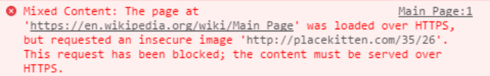
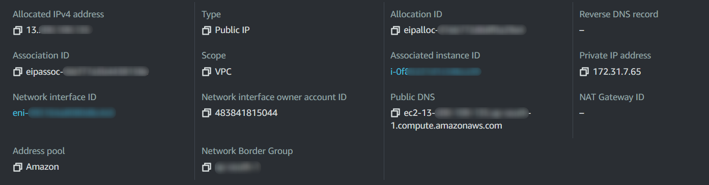

## A little backstory

It was a while back when I was working on one of my projects. I had my frontend ready as a React app hosted on GitHub pages to my custom domain. Everything was perfect and I deployed my backend server on an EC2 instance with an Elastic IP. Tried to use the combination in production, when I got hit with this error:



Yes, it was `Mixed Content` error and I had an idea to resolve it. The idea was simple. It was to basically upgrade my Express server from HTTP to HTTPs. Now, I know this sounds simple but when I started to do so, it turned out to be rather complex. Even though it was complex, I got to know so many things that I wouldn't have known if I wouldn't be hit by this error.

## How to go about it?

So, then, how to upgrade it? Well, I will first give you the whole technical summary of how my though process went and later put on the coding part.

## My Thought process

### The Certificates

As soon as I started the process, the first thought that crossed my mind were certificates. HTTPs was nothing but just short for HTTP with security which is implemented through SSL. For making sure that the server is not a bad entity, certificates are issued. Certificates are like a card of authentication which gives an idea about the server authenticity. In the above case, I was not having any certificates on my server, therefore the browser was not letting the request happen.

Certificates can be issued by a global trusted entity like Amazon, etc. or they could be self-signed. Obviously, the self-signed ones are rather insecure since they don't have any liabilities. Now, this is where the twists started, I tried to issue a certificate for my server.

> Question (`#8fa387`): Can you issue a certificate for a bare IP address?


Don't reveal the answer right away, search the internet first.


&nbsp;

What's the answer?


### IP's vs Domain Names

After this, there was a huge question about how to issue a certificate and more importantly, to which entity? An IP address or a domain name.



As it turns out, the certificate can be issued to domain names only. But, but, but, when I was going through some resources, I came across a website which issues certificate for IP addresses as well linked [here](https://zerossl.com/). I don't know how they do it but it works. (I haven't personally tested it but saw a YouTube video regarding the same) When I tried to do the same, it didn't work. It crashed on some error about the site being down. So, I resort to issuing a SSL certificate to my Elastic domain name which is present in the `Public DNS` field of the configuration above. (something ending with `*amazonaws.com`)

### Only a certain set of domains

It turns out you can't issue a certificate for AWS IP servers, if you are not Amazon itself. And for doing that, you require both time and money, since it then meant to issue certificates from Amazon themselves. But I was adamant and didn't want to use it, so I used my own domain for the process. The process afterwards went surprisingly well and easy.

### The Redirection

When I first set up my new subdomain for this task, I blindly configured it to be used with GitHub Pages which I later realized. After an hour of investigation as to why it isn't working, I came across about just adding an `A record` for redirecting it to the Elastic IP address on which my EC2 instance was configured.

### But, where did Nginx come from?

I promise this is the last section before coding. I know you might be having a lot of questions about the introduction of Nginx in the mix, but, bear with me here. Configuring Express to serve with HTTPs requires prior certificates and private keys that I didn't had access to. Therefore, I took the path with Nginx and passed all the traffic to Nginx which will then route the traffic back to my Express API server. For this, we need to shutdown some ports and open only some ports for the proper usage, this is where `ufw` will come into play. At the end of the day, this is how my architecture looked like - 


%%{init: {'theme': 'neutral' } }%%
flowchart RL
    subgraph Port 80
        direction RL
        A(Frontend) -->|"Takes request
        Over the internet"| B(Nginx)
    end
    subgraph Port 3000
        direction RL
        C(Nginx) --> |Forwards to| D(Express)
    end
    B --> |Internal Communication| C


Ok, now enough talking, let's get hands-on with this.

> Note: I won't be setting up an Express API, I will just signify the changes. The changes won't be done in your API but just the Nginx configuration.

## Let's jump to coding

### Configuring PM2 to keep your app running

Install `PM2` with the following command - 

> `npm` should be installed for the following command to work.

```bash
sudo npm i pm2 -g
```

Then, run the following command to run your file with name `index.js` - 

```bash
pm2 start index.js
```

Some other commands that might be helpful (for `PM2`) -

```bash
pm2 show index.js
pm2 status
pm2 restart index.js
pm2 stop index.js
pm2 logs # Show log stream
pm2 flush # Clear logs
```

Also, a very important command, if you want `PM2` to start on system startup automatically -

```bash
pm2 startup ubuntu # Your distribution name here
```

If you have any problems you can run `pm2 startup` to get the exact instructions regarding the same.

### Setup the `ufw` firewall

To enable `ufw`, use the following command - 

```bash
sudo ufw enable
```

Allow the rules for specific ports using the following commands - 

```bash
sudo ufw allow ssh # Port 22
sudo ufw allow http # Port 80
sudo ufw allow https # Port 443
```

Check the status of the service before moving on to the next step -

```bash
sudo ufw status
```

### Installing nginx and configuring it

We will first install Nginx in your EC2 instance, it can be done through different commands for your distro. For this tutorial, I'm using **Ubuntu**, therefore the command will look something like - 

```bash
sudo apt install nginx
```

After this, we have to edit the file `/etc/nginx/sites-available/default` using -

```bash
sudo nano /etc/nginx/sites-available/default
```

We have to add the following to the location part of the server block - 

```sh
    server_name yourdomain.com www.yourdomain.com;

    location / {
        proxy_pass http://localhost:3000; #whatever port your app runs on
        proxy_http_version 1.1;
        proxy_set_header Upgrade $http_upgrade;
        proxy_set_header Connection 'upgrade';
        proxy_set_header Host $host;
        proxy_cache_bypass $http_upgrade;
    }
```

Just check the Nginx config using - 

```bash
sudo nginx -t
```

And restart the Nginx service for the changes to take place - 

```bash
sudo service nginx restart
```

Now, you should be able to visit your IP address with the default port (80), and it should work just fine.

### Time for setting up SSL

For this, we would be using LetsEncrypt's certbot.

> If you're using any distro other than Ubuntu, take a look at [this link](https://certbot.eff.org/instructions) for instructions for different OSes. If you're using Ubuntu, you can follow along.

First, we will add the repo containing the `certbot` scripts using - 

```bash
sudo add-apt-repository ppa:certbot/certbot
```

Then we will update the system repo - 

```bash
sudo apt-get update
```

Then, we will install the certbot -

```bash
sudo apt-get install python-certbot-nginx
```

Finally, we will call the certbot for issuing the certificate -


Note: Before issuing the certificate, make sure that you have added an `A record` to your domain's DNS records for your preferred subdomain. The `A record` would look something like this -

| Key | Value |
| --- | --- |
| subdomain.domain.com | Your EC2 public IP address |

If you want to add a certificate for your apex domain, you can use `www` as your subdomain.


```bash
sudo certbot --nginx -d yourdomain.com -d www.yourdomain.com
```

## Conclusion

In this tutorial, we learnt about how to make an Express webserver serve while on HTTPs with the full setup on an EC2 instance. A quick note could be, that this is recreatable on any cloud provider's solution regardless of AWS. In the end, I would like to thank the reader for going through the article and I hope that you understood the thought process and the practical code that was written in the tutorial.

Until then, see ya!

## References

* https://gist.github.com/bradtraversy/cd90d1ed3c462fe3bddd11bf8953a896

## Don't bother to check this

#### Answer (`#8fa387`)
>
> No you can't. You need to have a domain name for doing that.
> 
> 
Let me take you back!


&nbsp;



